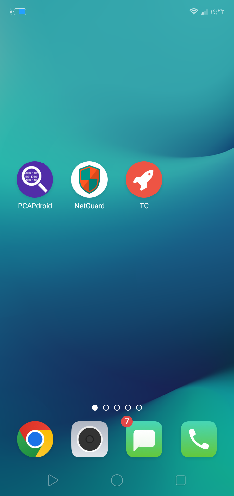

# Android Privacy Protection Project

This project documents my personal journey to improve my privacy and block trackers on my Android phone.

I'm a beginner, and I'm using free, open-source tools that work without root access.

---

## Objectives

- Block hidden trackers in apps
- Stop apps from sending my data without permission
- Analyze which apps are spying on me
- Use open-source tools (no root needed)

---

## Tools I'm Using

### 1. [TrackerControl (GitHub Version)](https://github.com/OxfordHCC/tracker-control-android)

- Detects and blocks trackers in apps
- Shows which companies are tracking you
- Helps control app network traffic

### 2. [NetGuard](https://play.google.com/store/apps/details?id=eu.faircode.netguard)

- Acts as a firewall (no root)
- Blocks internet access for specific apps
- Controls mobile/Wi-Fi data per app

### 3. [PCAPdroid](https://play.google.com/store/apps/details?id=tech.inaudible.pcapdroid)

- Monitors all network traffic
- Shows where apps are sending your data
- Exports data for deep analysis

---

## My Phone Info

- **Model:** Oppo A3s  
- **Android version:** 8.1  
- **Rooted:** No  
- **Internet type:** Wi-Fi + Mobile data  
- **Tools working without root:** Yes

---

## Current Screenshot

*This screenshot shows the privacy tools installed: PCAPdroid, NetGuard, and TrackerControl.*

---

## Next Steps

- [ ] Add screenshots from each app in use
- [ ] Share my results and what I found
- [ ] Try more privacy apps from GitHub
- [ ] Build a custom privacy dashboard

---

## Notes

This is a learning project. I’ll keep updating it as I test more apps and features. Feedback is welcome!
